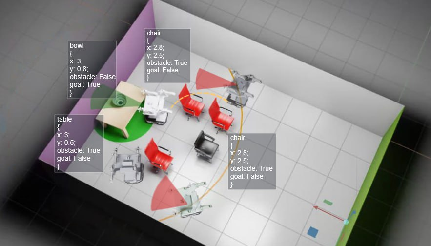

## Getting Started
<<<<<<< HEAD
The installation process fully complies with the official Isaac Lab documentation, with the exception that you need to clone the current pipeline, and not from the official Isaac Lab repository with Isaac sim 4.5
=======

### Documentation

Our [documentation page](https://isaac-sim.github.io/IsaacLab) provides everything you need to get started, including
detailed tutorials and step-by-step guides. Follow these links to learn more about:
>>>>>>> 1103a0f38f0ca480ff739944cf829c989f5cb8cf

- [Installation steps](https://isaac-sim.github.io/IsaacLab/main/source/setup/installation/index.html#local-installation)
- [Reinforcement learning](https://isaac-sim.github.io/IsaacLab/main/source/overview/reinforcement-learning/rl_existing_scripts.html)
- [Tutorials](https://isaac-sim.github.io/IsaacLab/main/source/tutorials/index.html)

The launch is carried out in accordance with the official documentation. The name of the environment - Isaac-Aloha-Direct-v0
The SAC algorithm of the skrl library is used here.

Train:
```
./isaaclab.sh -p scripts/reinforcement_learning/skrl/train.py --task Isaac-Aloha-Direct-v0 --num_envs 32 --enable_cameras --headless
```

Play:
```
./isaaclab.sh -p scripts/reinforcement_learning/skrl/play.py --task Isaac-Aloha-Direct-v0 --algorithm SAC --num_envs 1 --checkpoint /home/xiso/IsaacLab/logs/skrl/aloha/2025-08-11_09-55-36_ppo_torch_SAC/checkpoints/agent_14000.pt --enable_cameras
```

If you want record video you should add:
```
--video --video_length 512
```

Imitation learning:
For IL firsly you should get paths:
```
./isaaclab.sh -p path_generator.py
```
To generate paths via dijkstra algo (Check, that there no all_paths.json in data):
```
./isaaclab.sh -p source/isaaclab_tasks/isaaclab_tasks/direct/aloha/path_generator.py 
```
Asset directories should look like this:
```
└── aloha_assets
    ├── aloha
    │   ├── aloha.usd
    │   └── realsense.usd
    ├── objects
    │   └── bowl.usd
    └── scenes
        ├── obstacles
        └── scenes_sber_kitchen_for_BBQ
            ├── kitchen_new_simple.usd
            └── table
```
